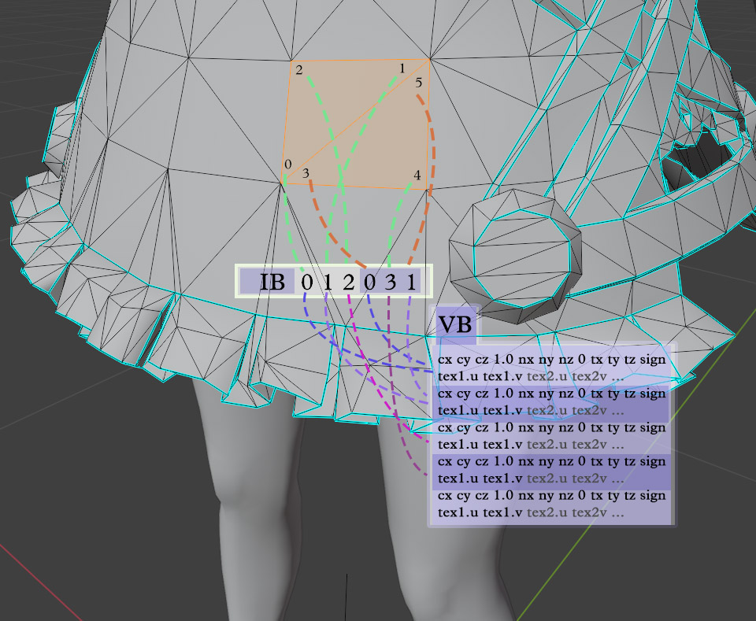

# IB-VB relation

The main info the game needs to render a character are the vertex-buffers (VB) and the index-buffer (IB). Characters use 3 VBs (VB0, VB1, and VB2), while models with no animations usually use only one (VB0).

A VB holds loop (a.k.a. face corner) coordinates, split normals, tangents, and uv data, outline thickness, etc.

::: tip
"Wait, if it is a loop buffer, why is it called 'vertex-buffer'?"
Dunno, people like giving bad names for things.
:::

Programmers could just store the data for each loop in a sequence and that'd be enough to reconstruct the object in-game, but that would result in **a lot of repeated data**. You see, it is very common for face-corners to have the same position, the same split-normals, and the same texture coordinates. It is the case for every time a face meets another in a smooth surface.

To tackle that, it's common practice to have the VB only store non-repeated data, and the IB to map the sequence of loops to the correspondent data stored in the VB.

Example: the first three loops form the first triangle of the 3d object. Their data are stored in the VB, and in the IB we store "use VB block 0, use VB block 1, use VB block 2". For the second triangle, we also have three loops, but two of the corners are the same as two from the first triangle. In this case, we can store only the data for the different loop in the VB, and in the IB we store "use VB block 0, use VB block 3, use VB block 1".

Loops using the same vertex would not use the same VB if the faces meet in a hard edge (like the cyan lines of the image), or if the faces are separated in the texture map.