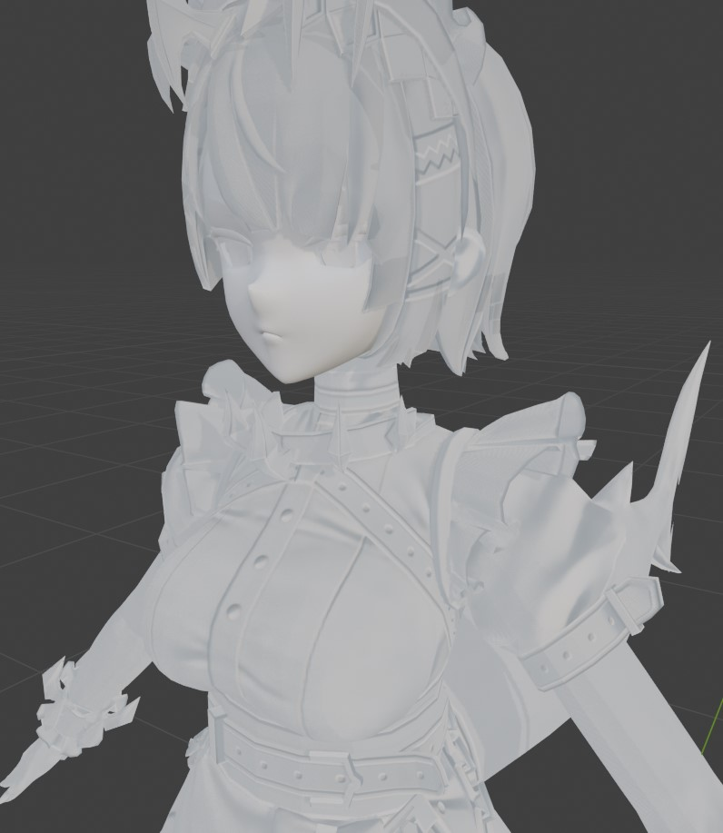

# INI files

3DMigoto uses “.ini” files to describe how mods should be loaded. Note that this does not follow the exact official definition of what an INI file should look like.

::: tip
The order each block appears in the file doesn't matter.
:::

::: tip
The order each param in a block appears DOES matter. For some configs it ends up behaving the same (Ex.: a `handling=skip` at the end works the same as if in the start of the block), but there's a 'sequentiality' to some params (more on the `drawindexed` topic).
:::

Instead of listing all possible configurations for the INI file, let's start with a simple use case with most common functionality.

```ini
[TextureOverrideEllen2Hair.Blend]
hash = e91c93e0
handling = skip
vb2 = ResourceEllen2HairVB2
if DRAW_TYPE == 1
	vb0 = ResourceEllen2HairVB0
	draw = 6063, 0
endif
[TextureOverrideEllen2Hair.Texcoord]
hash = a27a8e1a
vb1 = ResourceEllen2HairVB1
[TextureOverrideEllen2Hair.VertexLimitRaise]
hash = 77ac5f85
[TextureOverrideEllen2Hair.IB]
hash = d44a8015
handling = skip
ib = ResourceEllen2HairIB
ps-t3 = ResourceEllen2Hair1D
ps-t4 = ResourceEllen2Hair2N
ps-t5 = ResourceEllen2Hair3M
ps-t6 = ResourceEllen2Hair3M
drawindexed = auto

[ResourceEllen2HairVB0]
type = Buffer
stride = 40
filename = Ellen2HairVB0.buf
[ResourceEllen2HairVB1]
type = Buffer
stride = 24
filename = Ellen2HairVB1.buf
[ResourceEllen2HairVB2]
type = Buffer
stride = 32
filename = Ellen2HairVB2.buf
[ResourceEllen2HairIB]
type = Buffer
format = DXGI_FORMAT_R16_UINT
filename = Ellen2HairIB.buf

[ResourceEllen2Hair1D]
filename = EllenLingerie1D.dds
[ResourceEllen2Hair2N]
filename = EllenLingerie2N.dds
[ResourceEllen2Hair3M]
filename = EllenLingerie3M.dds
```

Here we see two types of INI blocks: `TextureOverride` and `Resource`.

::: note
`TextureOverride` and `Resource` are "reserved terms" for 3DMigoto, as it looks for blocks with names starting with those terms to do its thing. On the other hand, what you can write on the rest of the block's name has no effect on the logic.
:::

::: tip
Use descriptive names for INI blocks. If the name ends up exactly the same as one in another mod, it will result in a conflict.
:::

### TextureOverride
Each TextureOverride block in the INI expects the in-game “hash”, that identifies what is being overridden. Despite it's name, it overrides not only textures, but also buffers and other things.
* `hash`: a 32-bit attribute (8 hexadecimal digits).
* `handling = skip`: used along TextureOverride blocks with `draw` and `drawindexed` params. I basically means "skip the original thing you to for this hash".
* `vb0`, `vb1`, `vb2`, `ib`: Overrides data with a resource.
* `if DRAW_TYPE == 1`: Yes, INI files support some logic. `if`-`endif` blocks are powerful tools. The `DRAW_TYPE == 1` will be explained... once I understand what it means. That's the thing, you don't have to understand everything from the start. Just stick to defaults, and explore what it all means little by little.
* `draw = 6063, 0`: specify a segment of the VBs to use. In this case it would be "read 6063 blocks to the GPU, starting from position 0", where 6063 is the total count of blocks.

::: tip
XXMI has a newer version of 3DMigoto that supports a `draw = auto` at this point, for the default case when you want to use the whole VB.
:::

* `ps-tX`: specify what resource to use for a particular texture slot (Ex.: `ps-t3` means "pixel shader - texture slot 3"). More on texture slots on the INI Texture Slots section.
* `draindexed`: use a portion of the IB to index what to draw. More on the [IB-VB relation](./ib-vb.md). There's 2 ways to use this:
  * `drawindexed = auto` to reference the whole IB.
  * `drawindexed = 5220, 16983, 0` to use just a range of the IB. In this example, it would mean "draw based on 5220 indices, starting from position 16983" (nope, I don't know what the last '0' means, it's always '0').

### Resources
Resources are what the INI use to reference all other files in your mod. They have many usages, but let's stick to referencing ".buf" buffers and ".dds" textures for now.

VB resources have a `stride` param to indicate how many bytes each block of the buffer uses. IB resources use the `format` param (it would be `DXGI_FORMAT_R32_UINT` for 32-bit indices).

## Select what parts of a model to render TODO
You can use multiple `drawindexed` lines on the same IB block, each corresponding to a different part of your model

## The `CommandListSkinTexture`
You've maybe seen a line with `run = CommandListSkinTexture` in INI files, and simply added it in all IB blocks, but it's important to understand what it actually does.
The `CommandListSkinTexture` is defined in `.\d3d.ini` for ZZMI and in `.\ZZMI\Core\ZZMI\main.ini` for XXMI. It reads as follows:
```ini
[CommandListSkinTexture]
if $costume_mods
    checktextureoverride = ps-t1
    checktextureoverride = ps-t2
    checktextureoverride = ps-t3
    checktextureoverride = ps-t4
    checktextureoverride = ps-t5
    checktextureoverride = ps-t6
    checktextureoverride = ps-t7
    checktextureoverride = ps-t8
    checktextureoverride = ps-t9
    checktextureoverride = ps-t10
    x140 = 0
endif
```
It can translate to something like "Hey, check if anything is overridden for the hashes currently on these `ps-t` texture slots, and if so replace them".
But why do it this way? Isn't it easier to just specify the texture slots in the IB block?

You see, unlike a game like Genshin, in ZZZ **what texture goes in each slot varies**. Have you ever used a lovely modded coffee shop door, and it only works at daytime? It's because in daytime the model expects the diffuse on the `ps-t2` slot, but at night it expects it in the `ps-t5` slot. To address that, the `checktextureoverride` comes in handy, as you can "TextureOverride" the texture itself (using its hash), and have it replaced in the actual slot it is expected.

```ini
[TextureOverride.MyDiffuse]
hash = 4ecc12a1
this = ResourceMyDiffuse
[ResourceMyDiffuse]
filename = MyDiffuse.dds
```

Although this method solves many problems a mod creator can face, it limits how a mod can be implemented in some aspects. A clear example being the whole FlatNormalMap entangle.

## The FlatNormalMap
In the 1.3 update, ZZZ started using the same hash for every NormalMap texture. Everywhere you check, the hash is always "ebac056e" for 2k textures and "798adba3" for 1k. People trying to use ZZMI probably have faced a problem where the mods appear with strange lines all over the place


*Example of wrong normal maps*

To address that, ZZZ's version of XXMI comes bundled with a default "FlatNormalMap" TextureOverride (you can see it on the end of the `.\ZZMI\Core\ZZMI\main.ini`), It simply overrides all normalMaps with a square gray image, as gray indicates no "bumps" in the normals, making it all "flat".

While this removes the weird shadows, we do lose a bit of quality on the end result. Even if the diffuses can carry a lot of weight on the quality, here's an example of the detail a normalMap adds to a model:


*How much detail a normal map adds on its own*

## The `filter_index` approach
There is, although, a light in the end of the tunnel.
If you use a parameter called `filter_index` in the TextureOverride of a texture, you can "mark" what slot it is being used in.

```ini
[TextureOverride.MyDiffuse]
hash = 4ecc12a1
filter_index = 1234

[TextureOverride.MyIB]
hash = 4b48b731
handling = skip
if ps-t2 == 1234
    ps-t2 = ResourceMyDiffuse
elif ps-t5 == 1234
    ps-t5 = ResourceMyDiffuse
endif
drawindexed = auto

[ResourceMyDiffuse]
filename = MyDiffuse.dds
```

There are, however, some caveats you need to look for when using this method:
* The check is lost after you assign something to the slot. For example, comparing `ps-t2 == 1234` will no longer function if it's after the `ps-t2 = ResourceMyDiffuse`.
* You have to check all the possibles slots a texture can be in. It's often only 2 or 3 slots, but you have to know where they are, and that can lead to a lot of testing. On the other hand, the textures tend to come in the same order. If ps-t2 is the diffuse, you can count on ps-t3 to be the NormalMap a ps-t4 to be the MaterialMap*


## custom textures for each model PART TODO