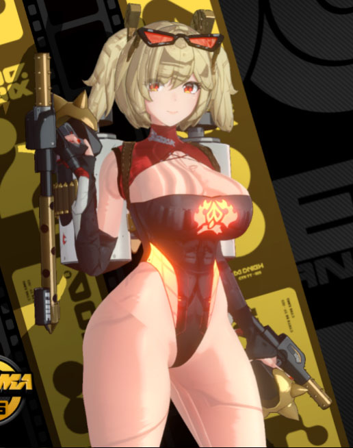
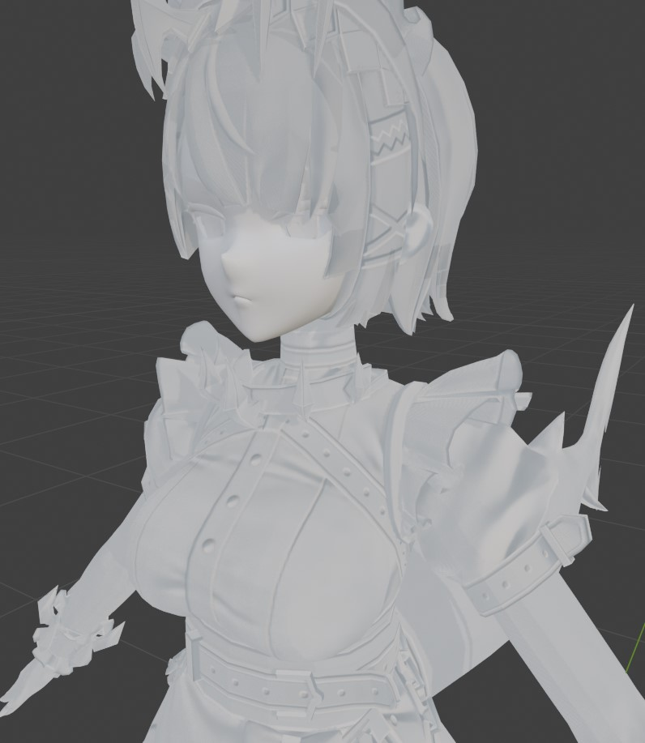

# Beyond the Basics - Texture Slots

## The `CommandListSkinTexture`
You've maybe seen a line with `run = CommandListSkinTexture` in INI files, and simply added it in all IB blocks, but it's important to understand what it actually does.
The `CommandListSkinTexture` is defined in `.\d3d.ini` for ZZMI and in `.\ZZMI\Core\ZZMI\main.ini` for XXMI. It reads as follows:
```ini
[CommandListSkinTexture]
if $costume_mods
    checktextureoverride = ps-t1
    checktextureoverride = ps-t2
    checktextureoverride = ps-t3
    checktextureoverride = ps-t4
    checktextureoverride = ps-t5
    checktextureoverride = ps-t6
    checktextureoverride = ps-t7
    checktextureoverride = ps-t8
    checktextureoverride = ps-t9
    checktextureoverride = ps-t10
    x140 = 0
endif
```
It can translate to something like "Hey, check if anything is overridden for the hashes currently on these `ps-t` texture slots, and if so replace them".
But why do it this way? Isn't it easier to just specify the texture slots in the IB block?

You see, unlike a game like Genshin, in ZZZ **what texture goes in each slot varies**. Have you ever used a lovely modded coffee shop door, and it only works at daytime? It's because in daytime the model expects the diffuse on the `ps-t2` slot, but at night it expects it in the `ps-t5` slot. To address that, the `checktextureoverride` comes in handy, as you can "TextureOverride" the texture itself (using its hash), and have it replaced in the actual slot it is expected.

```ini
[TextureOverride.MyDiffuse]
hash = 4ecc12a1
this = ResourceMyDiffuse
[ResourceMyDiffuse]
filename = MyDiffuse.dds
```

Although this method solves many problems a mod creator can face, it limits how a mod can be implemented in some aspects. A clear example being the whole FlatNormalMap entangle.

## The FlatNormalMap
In the 1.3 update, ZZZ started using the same hash for every NormalMap texture. Everywhere you check, the hash is always "ebac056e" for 2k textures and "798adba3" for 1k. People trying to use ZZMI probably have faced a problem where the mods appear with strange lines all over the place


*Example of wrong normal maps*

To address that, ZZZ's version of XXMI comes bundled with a default "FlatNormalMap" TextureOverride (you can see it on the end of the `.\ZZMI\Core\ZZMI\main.ini`), It simply overrides all normalMaps with a square gray image, as gray indicates no "bumps" in the normals, making it all "flat".

While this removes the weird lines, we do lose a bit of quality on the end result. Even if the diffuses can carry a lot of weight on the quality, here's an example of the detail a normalMap adds to a model:


*How much detail a normal map adds on its own*

## The `filter_index` approach
There is, although, a light at the end of the tunnel.
If you use a parameter called `filter_index` in the TextureOverride of a texture, you can "mark" what slot it is being used in.

```ini
[TextureOverride.MyDiffuse]
hash = 4ecc12a1
filter_index = 1234

[TextureOverride.MyIB]
hash = 4b48b731
handling = skip
if ps-t2 == 1234
    ps-t2 = ResourceMyDiffuse
elif ps-t5 == 1234
    ps-t5 = ResourceMyDiffuse
endif
drawindexed = auto

[ResourceMyDiffuse]
filename = MyDiffuse.dds
```

There are, however, some caveats you need to look for when using this method:
* The check is lost after you assign something to the slot. For example, comparing `ps-t2 == 1234` will no longer function if it's after the `ps-t2 = ResourceMyDiffuse`.
* You have to check all the possible slots a texture can be in. It's often only two or three slots, but you have to know where they are, and that can lead to a lot of testing. On the other hand, the textures tend to come in the same order. If ps-t2 is the diffuse, you can count on ps-t3 to be the NormalMap a ps-t4 to be the MaterialMap*

### Restoring original textures

If you're modding something that uses a texture shared among many models (aaagh the whole Lumina square is blinking like crazy) you can override the slot again with the original texture, after the `drawindexed`. This won't be a problem if you're just modding characters, but try to replace a B-rank engine with an aranara and you'll understand what I mean.

```ini
[TextureOverride.MyIB]
hash = 4b48b731
handling = skip
ps-t2 = ResourceMyDiffuse
drawindexed = auto
ps-t2 = ResourceOriginalDiffuse

[ResourceMyDiffuse]
filename = MyDiffuse.dds

[ResourceOriginalDiffuse]
filename = OriginalDiffuse.dds
```

## Different textures for model parts
One neat thing you can do is use different textures for each `drawindexed`:
```ini
[TextureOverrideEllenHair.IB]
hash = d44a8015
handling = skip
ib = ResourceEllenHairIB
; MAT_Ellen_Body_2
drawindexed = 10440, 0, 0
; Material.002
ps-t3 = ResourceEllenHair1Diffuse
ps-t4 = ResourceEllenHair2Normal
ps-t5 = ResourceEllenHair3Material
ps-t6 = ResourceEllenHair3Alter
drawindexed = 13218, 10440, 0
; Material.003
ps-t3 = ResourceEllenHair1Diffuse2
ps-t4 = ResourceEllenHair2Normal2
ps-t5 = ResourceEllenHair3Material2
ps-t6 = ResourceEllenHair3Alter2
drawindexed = 22920, 13218, 0
```
Yes, this works.

With this approach, you don't need to merge textures, scale UVs, etc. I've tested it and didn't notice any performance issues.